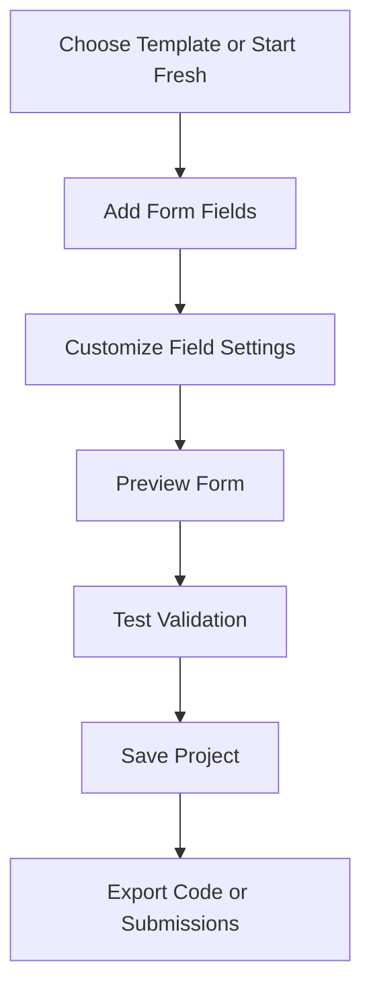
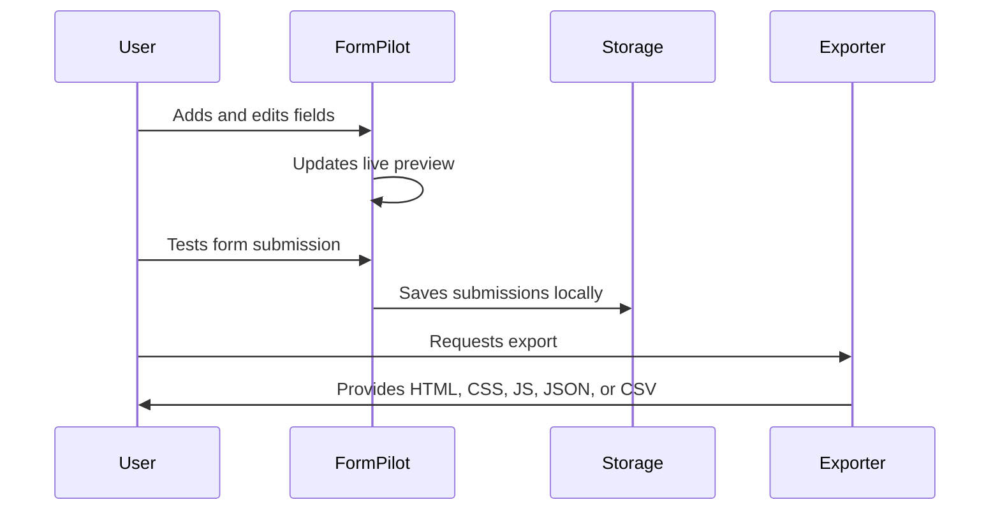

<div align="center">


# FormPilot

### A cute, modern, responsive JavaScript form builder for creating, validating, saving, and exporting beautiful forms.

[](#)
[](#)
[](#)
[](LICENSE)

**Built with care by [Himani Singh](https://github.com/HimaniSingh3)**

[Features](#features) • [Demo Guide](#demo-guide) • [Installation](#installation) • [Folder Structure](#folder-structure) • [Author](#author)

</div>

---

## About

**FormPilot** is a polished frontend project that lets users visually build custom forms, preview them instantly, validate input, save projects locally, manage submissions, and export production-ready form code.

It is designed as a clean portfolio project with a strong user interface, modular JavaScript structure, responsive styling, and practical real-world features.

> FormPilot is not just a form UI. It is a complete mini form-building workspace.

---

## Project Snapshot

| Detail | Information |
|---|---|
| Project Name | **FormPilot** |
| Category | Form Builder / Frontend Tool |
| Author | **Himani Singh** |
| Tech Stack | HTML, CSS, JavaScript, Vite |
| Storage | Browser `localStorage` |
| Export Support | HTML, CSS, JavaScript, JSON, CSV |
| Responsive | Yes |
| Theme Support | Dark Mode and Light Mode |

---

## Features

| Feature | Description |
|---|---|
| Visual Form Builder | Add and customize form fields with a clean builder interface |
| Field Editor | Edit labels, placeholders, helper text, validation rules, and options |
| Starter Templates | Start quickly with ready-made form templates |
| Live Preview | Preview the form instantly while editing |
| Validation Engine | Validate required fields, email, min/max values, length, and patterns |
| Submission Manager | Store and review submitted form data locally |
| CSV Export | Export collected submissions as a CSV file |
| Code Exporter | Export standalone HTML, CSS, and JavaScript |
| Project Import/Export | Save and restore complete form projects as JSON |
| Theme Toggle | Switch between dark and light mode |
| Responsive Layout | Works on desktop, tablet, and mobile |
| Verification Script | Includes a project verification command |

---

## Demo Guide

Use FormPilot to build forms such as:

| Form Type | Example Use |
|---|---|
| Client Intake Form | Collect client details and project requirements |
| Event Registration Form | Register attendees and collect preferences |
| Feedback Survey | Gather ratings, comments, and suggestions |
| Contact Form | Collect name, email, subject, and message |
| Application Form | Create custom user application workflows |

---

## Tech Stack

| Technology | Purpose |
|---|---|
| **HTML5** | Page structure |
| **CSS3** | Styling, layout, themes, and responsiveness |
| **JavaScript** | App logic, state, validation, export, and interactivity |
| **Vite** | Fast development server and production build |
| **localStorage** | Saving forms, themes, and submissions in the browser |

---

## Installation

Clone the repository:

```bash
git clone https://github.com/HimaniSingh3/FormPilot.git
```

Move into the project folder:

```bash
cd FormPilot
```

Install dependencies:

```bash
npm install
```

Start the development server:

```bash
npm run dev
```

---

## Available Scripts

| Command | Description |
|---|---|
| `npm run dev` | Starts the local development server |
| `npm run build` | Builds the project for production |
| `npm run preview` | Previews the production build locally |
| `npm run verify` | Checks required project files and structure |

---

## Build for Production

Create a production build:

```bash
npm run build
```

Preview the production build:

```bash
npm run preview
```

The generated production files will be created inside the `dist` folder.

---

## Folder Structure

```text
FormPilot/
├── public/
│   └── logo.svg
├── scripts/
│   └── verify.mjs
├── src/
│   ├── config/
│   │   └── constants.js
│   ├── core/
│   │   ├── dom.js
│   │   └── state.js
│   ├── data/
│   │   ├── fieldTypes.js
│   │   └── templates.js
│   ├── services/
│   │   ├── exporter.js
│   │   ├── projectIO.js
│   │   ├── storage.js
│   │   └── validation.js
│   ├── styles/
│   │   ├── base.css
│   │   ├── components.css
│   │   ├── forms.css
│   │   ├── layout.css
│   │   ├── responsive.css
│   │   └── themes.css
│   ├── utils/
│   │   ├── debounce.js
│   │   ├── download.js
│   │   ├── escape.js
│   │   └── id.js
│   └── main.js
├── .gitignore
├── index.html
├── LICENSE
├── package.json
├── vite.config.js
└── README.md
```

---

## Core Modules

| File | Responsibility |
|---|---|
| `src/main.js` | Main application rendering and event handling |
| `src/core/state.js` | Central app state |
| `src/core/dom.js` | DOM helper utilities |
| `src/data/fieldTypes.js` | Available form field definitions |
| `src/data/templates.js` | Starter form templates |
| `src/services/validation.js` | Form validation logic |
| `src/services/exporter.js` | HTML, CSS, and JavaScript export generation |
| `src/services/projectIO.js` | Project import and export handling |
| `src/services/storage.js` | Browser storage helpers |
| `src/utils/download.js` | File download utility |
| `src/utils/escape.js` | Safe string escaping |
| `src/utils/id.js` | Unique ID generation |
| `scripts/verify.mjs` | Project structure verification |

---

## Supported Field Types

| Field Type | Supported |
|---|---|
| Text Input | Yes |
| Email Input | Yes |
| Number Input | Yes |
| Password Input | Yes |
| Date Input | Yes |
| Textarea | Yes |
| Select Dropdown | Yes |
| Radio Group | Yes |
| Checkbox | Yes |

---

## Export Options

FormPilot supports multiple export workflows:

| Export Type | Description |
|---|---|
| HTML Export | Generates standalone form markup |
| CSS Export | Generates clean responsive styling |
| JavaScript Export | Generates validation and submit logic |
| JSON Export | Saves the full FormPilot project structure |
| CSV Export | Exports collected submissions |

---

## Validation Support

FormPilot includes a custom validation system for:

- Required fields
- Email format
- Number fields
- Minimum length
- Maximum length
- Minimum value
- Maximum value
- Pattern-based validation
- Checkbox validation
- Select and radio validation

---

## How It Works



---

## User Flow



---

## Highlights

<details>
<summary><strong>Clean Frontend Architecture</strong></summary>

FormPilot is organized into separate folders for configuration, data, services, utilities, state, and styles. This makes the project easier to read, maintain, and expand.

</details>

<details>
<summary><strong>Responsive Design</strong></summary>

The layout is designed to adapt smoothly across desktop, tablet, and mobile screens. The builder, preview, and export panels remain usable on smaller devices.

</details>

<details>
<summary><strong>Local First Experience</strong></summary>

Projects, themes, and submissions are handled through browser storage, so the app works without a backend.

</details>

<details>
<summary><strong>Code Export System</strong></summary>

The exporter generates standalone HTML, CSS, and JavaScript so users can reuse their forms outside FormPilot.

</details>

---

## What Makes FormPilot Special?

- It feels like a mini SaaS product.
- It has practical real-world use cases.
- It demonstrates strong frontend logic.
- It includes state management without a heavy framework.
- It supports import, export, validation, preview, and storage.
- It is clean enough for beginners and impressive enough for a portfolio.

---

## Roadmap

- [x] Visual form builder
- [x] Field editor
- [x] Live preview
- [x] Form validation
- [x] Local submissions
- [x] CSV export
- [x] Project JSON export
- [x] Project JSON import
- [x] Dark and light themes
- [x] Responsive design
- [ ] Drag and drop field sorting
- [ ] Multi-step form builder
- [ ] More field types
- [ ] Form analytics dashboard
- [ ] Custom theme editor
- [ ] Cloud sync support

---

## Screenshots

> Add screenshots here after running the project locally.

| Builder | Preview | Export |
|---|---|---|
| Add screenshot | Add screenshot | Add screenshot |

---

## Customization Ideas

You can extend FormPilot with:

- More templates
- Drag and drop sorting
- Form sections
- Multi-page forms
- Conditional fields
- Custom themes
- Backend submission support
- Authentication
- Dashboard analytics
- AI-powered field suggestions

---

## Contributing

Contributions are welcome.

To contribute:

1. Fork the repository
2. Create a new branch
3. Make your changes
4. Test the project
5. Submit a pull request

```bash
git checkout -b feature/your-feature-name
```

---

## Project Quality Checklist

- [x] Clean folder structure
- [x] Responsive design
- [x] Modular JavaScript
- [x] Reusable services
- [x] Local storage support
- [x] Export features
- [x] Validation logic
- [x] No unnecessary cache files
- [x] Beginner-friendly setup
- [x] Portfolio-ready presentation

---

## Author

<div align="center">

### Himani Singh

Frontend creator and project author.

[GitHub Profile](https://github.com/HimaniSingh3)

</div>

---

## License

This project is licensed under the **MIT License**.

See the [LICENSE](LICENSE) file for details.

---

## Support

If you like this project, consider giving it a star on GitHub.

It helps support the project and motivates more improvements.

---

<div align="center">

## FormPilot

**Build forms beautifully. Validate them smartly. Export them easily.**

Made with JavaScript, creativity, and care by **Himani Singh**.

</div>
